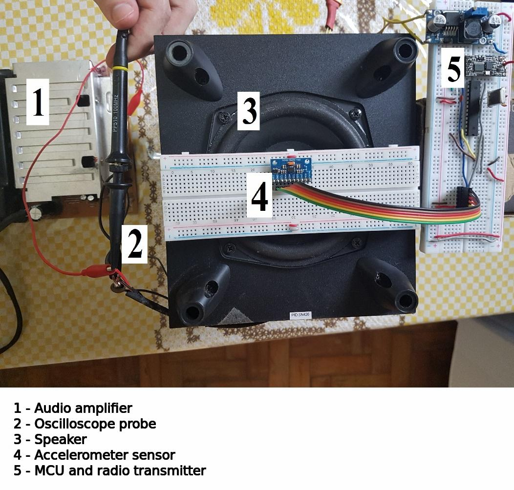
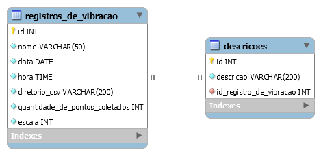

# Three-axis-vibration-spectrum-analyzer-project
> This project is a low cost three axis vibration spectrum analyzer that allows for remote and real time acquisition of the vibration data. The embedded hardware has a MEMS accelerometer and a Microchip PIC. The desktop app is being developed in Python and uses MySQL database to store information about data vibration patterns acquired.

## Hardware

A PIC16F883 microcontroller and an MPU9250 accelerometer were used to perform the acquisition of the vibration data. Two HC-12 radio transmitters/receivers were used to form a telemetry system. A supervisory was developed in Python-Tkinter with an interface to MySQL database management system. 

## Desktop App 

## Tests

Tests were performed as shown bellow, with signals coming from a signal generator...

 

The results showed that the system was able to sample at a rate of 1181.68 Hz per axis, having an error less than 0.6 % in measurement of vibration frequencies up to 490 Hz. The telemetry allowed operation at a distance of up to 115 meters. Furthermore, the supervisory program was able to store the information from the vibration records in the database. Future work may allow the classification of vibration signals in real time in the supervisory system using artificial intelligence algorithms.

## Database

The Entity-Relationship Diagram for the database is...

 

## Updates and Progress

- [x] Build Hardware
- [x] Develop firmware 
- [x] Setup database
- [x] Desktop App - Frontend
- [x] Desktop App - Real time plot
- [x] Desktop App - Database interface
- [ ] Desktop App - Adding backend functionality to all elements
- [ ] Desktop App - Machine learning model to identify vibration patterns
- [ ] Final tests and ajustments

# Meta

Igor Goulart de Almeida - [Linkedin](https://www.linkedin.com/in/igor-goulart-de-almeida-33a96711a/)
MIT licence
<https://github.com.br/seuusuario/seuprojeto>

